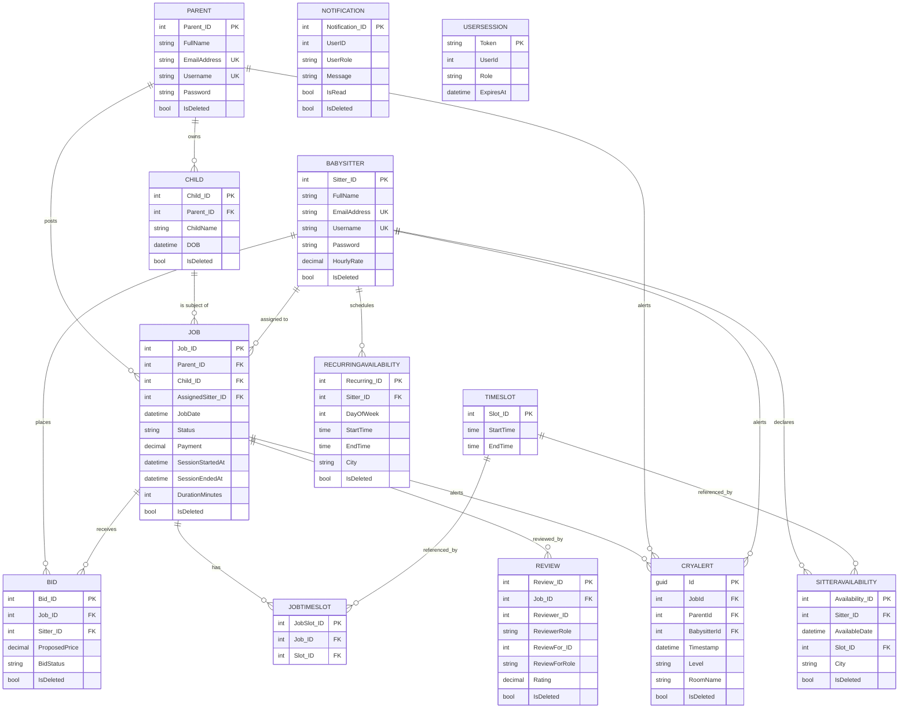

# UNIFIED BACKEND FINAL BLUEPRINT

**Babysitter Booking & Baby Minder Platform — Unified Backend**

| | |
|---|---|
| **Document status** | Final Architecture Blueprint (Planning / Analysis only) |
| **Phase** | Architecture freeze — NO implementation code written |
| **Target stack** | .NET Framework 4.7.2 · ASP.NET Web API 2 · Entity Framework 6 · SQL Server · EF6 Code First + Migrations |
| **Primary foundation** | API-C (`WebApplication2`) |
| **Reference sources** | API-A (`Final_year_1_project_Api`), API-B (`Final_year_1_project_Api_zain`) |
| **Scope** | Parent · Babysitter · Child · Job · Availability · Matching · Bidding · Session · Review · Notification · Cry Alert · Image · Session Auth |
| **Explicitly out of scope** | Admin module, JWT (unless later approved), ASP.NET Core, EF Core, microservices, CQRS, MediatR, event sourcing |

> **How to read this document.** Every claim is labelled either **[FACT]** (verified directly from source code in this workspace) or **[RECOMMENDATION]** (a proposed design decision). Existing behaviour is described under "Current", problems under "Problem", and future behaviour under "Recommended". This document is the single source of truth for the architecture meeting and the subsequent implementation phases.

---

## 1. Executive Summary

Three independent ASP.NET Web API projects exist in this workspace. They are **not** three competing implementations of the same feature set; they are three successive generations of the same idea, each adding concepts on top of the previous one.

| Project directory | Conceptual ID | Verified character | Role |
|---|---|---|---|
| `Final_year_1_project_Api` | **API-A** | Minimal Web API. Plain-text auth. Single god `AuthController`. `Schedule` holds recurring weekly availability (`day_of_week`, `time_slot` string). | Reference for **recurring weekly availability** |
| `Final_year_1_project_Api_zain` | **API-B** | Near-copy of API-A with `EnableCors`, a `Schedule` that stores `TimeSpan` start/end, and `AvailabilitySlot`/`SetAvailabiltyModel`/`SlotModel` request DTOs. | Reference for **TimeSpan-based slots** |
| `WebApplication2` | **API-C** | The strongest and most complete backend. Session-token auth, Parent/Babysitter/Child/Job/Availability/Matching/Review/Notification/CryAlert/Image modules, soft deletes, DTOs, validation, Swagger. Uses EF6 **Database-First (EDMX)**. | **Primary foundation** |

**Core conclusions**

1. **API-C is the correct foundation.** It contains the only real authentication model, the only real job system, the only matching engine, soft deletes, DTOs, and validation infrastructure. API-A and API-B are not viable foundations — they are single-controller prototypes with plain-text passwords and no authorization.
2. **API-C's most serious architectural defect is not its features — it is its data-access approach.** It uses EF6 Database-First (EDMX) with `UnintentionalCodeFirstException`, no Service layer, and business logic embedded in controllers. The unified backend must keep API-C's **feature set and JSON contracts** but rebuild the **data layer** as EF6 Code First with a Service layer.
3. **Bidding is declared but not implemented in API-C.** A `Bid` entity and `BidDTO` exist, and `Bid` rows are soft-deleted during account deactivation, but **no controller exposes bid creation/acceptance**. This is the single largest "missing feature" to design from scratch.
4. **Recurring weekly availability is entirely absent from API-C.** API-C's `SitterAvailability` is strictly date-specific (`AvailableDate` + `Slot_ID` + `City`). API-A/B's recurring `Schedule` concept must be merged in.
5. **Session duration tracking is absent.** API-C has `JobDate` + `TimeSlot` start/end, and a `start-session`/`updateStatus` endpoint, but no `SessionStartedAt`, `SessionEndedAt`, or authoritative `DurationMinutes`. This must be designed.
6. **The frontend is NOT present in this workspace.** No React/Node project, no `package.json`, no `.jsx/.tsx` files. Therefore the frontend-compatibility matrix in §17 is derived **only from API-C's own controllers/DTOs and its in-repo contract docs**, and must be validated against the real frontend before implementation.

The recommended target is a **thin-controller / service-layer / Code-First** architecture that preserves API-C's routes and JSON shapes while adding: EF6 Code First migrations, a Service layer, BCrypt-first password hashing, recurring availability, a real bidding flow, session timing, and database-level integrity constraints.

---

## 2. Architecture Decision

### 2.1 Technology (locked)

**[FACT]** All three projects target .NET Framework 4.7.2 and ASP.NET Web API 2 (verified via `Web.config` `targetFramework="4.7.2"` and `System.Web.Http` 5.3.0). API-C uses EF 6.5.1, Newtonsoft.Json 13.0.3, Swashbuckle 5.6.0, BCrypt.Net-Next 4.0.3, and SQL Server (`DESKTOP-UD649GB\SQLEXPRESS`, database `BabySitterBooking and BabyMinder`).

**[RECOMMENDATION]** The unified backend keeps the exact same ecosystem:
- .NET Framework 4.7.2, ASP.NET Web API 2 (attribute routing), EF6 Code First, SQL Server.
- Newtonsoft.Json for JSON (preserves camelCase/PascalCase behaviour identical to API-C).
- Swashbuckle for Swagger/UI (API-C redirects `/` → `/swagger`).
- **No** ASP.NET Core, **no** EF Core, **no** Node.js, **no** microservices, **no** CQRS/MediatR/event-sourcing.

### 2.2 Data-access decision: Database-First → Code First

**[FACT]** API-C's `Model1.Context.cs` throws `UnintentionalCodeFirstException` in `OnModelCreating`, and `Web.config` connection strings use `metadata=res://*/Models.Model1.csdl|ssdl|msl` (EDMX). All three projects are Database-First.

**[RECOMMENDATION]** The unified backend is **EF6 Code First**:
- POCO entities in `Models/`.
- A single `UnifiedDbContext : DbContext` in `Data/`.
- Fluent API configuration classes in `Data/Configurations/` (one per aggregate, `EntityTypeConfiguration<T>`).
- EF6 Code First Migrations in `Migrations/`.
- **No `.edmx` file** in the unified project.
- A **new database** created by the initial migration — no existing database is modified.

### 2.3 Layering decision

**[FACT]** API-C controllers directly instantiate `BabySitterBooking_and_BabyMinderEntities` and contain business logic (availability conflict checks, payment calculation, session start rules, soft-delete cascades) inline.

**[RECOMMENDATION]** Target layering:

```
Controllers  (thin: HTTP in/out, basic shape validation, call services)
    ↓
Services     (business rules, transactions, orchestration)
    ↓
DbContext    (EF6 Code First)
    ↓
SQL Server
```

- Controllers **must not** contain large workflows.
- Services may use the DbContext directly.
- **No** generic repository, **no** Unit-of-Work, **no** extra abstraction layers.
- Dependency inversion is applied via interfaces only where they pay for themselves (`IAuthService`, `IJobService`, `IAvailabilityService`, `IMatchingService`, `INotificationService`, `IReviewService`).

### 2.4 Why not JWT

**[FACT]** API-C authenticates with an **opaque database-backed session token** stored in `UserSessions` (`Token` PK, `UserId`, `Role`, `CreatedAt`, `ExpiresAt`), validated by `SessionAuthorizeAttribute`, with 7-day expiry (`SessionExpiryDays=7` in `Web.config`). JWT packages (`System.IdentityModel.Tokens.Jwt` 6.35.0) are present in `packages.config` but are **not used** by any controller.

**[RECOMMENDATION]** Keep the opaque session-token model. It is simple, revocable (logout = `DELETE FROM UserSessions`), compatible with the existing frontend, and appropriate for FYP scope. **Do not introduce JWT** unless a specific requirement (e.g. stateless horizontal scale) is later approved as a decision.

---

## 3. Complete API Comparison

### 3.1 Project structure comparison

| Aspect | API-A | API-B | API-C |
|---|---|---|---|
| Controllers | `AuthController` (god), `HomeController`, `ValuesController` | `AuthController` (god), `HomeController`, `ValuesController` | `Auth`, `Parent`, `BabySitter`, `Children`, `Jobs`, `Matching`, `Notifications`, `Review`, `CryDetection`, `Image` |
| Auth | Plain-text email+password+role match | Plain-text email+password+role match | Opaque session token in `UserSessions`, `SessionAuthorizeAttribute` |
| EF approach | Database-First EDMX | Database-First EDMX | Database-First EDMX |
| DbContext | `BabySitterBookingAndBabyMinderEntities1` | `BabySitterBookingandBabyMinderFypEntities1` | `BabySitterBooking_and_BabyMinderEntities` |
| DTO layer | None (raw entities / anonymous types) | `AvailabilitySlot`, `SetAvailabiltyModel`, `SlotModel` | Full `DTOs/` folder |
| Service layer | None | None | None |
| Validation | None | None | `ValidationHelper` (static) |
| Soft delete | None | None | `IsDeleted` on Parent/Babysitter/Child/Job/Bid/Review/Notification/SitterAvailability/CryAlert |
| Swagger | HelpPage | HelpPage | Swashbuckle |
| CORS | None | `[EnableCors("*","*","*")]` | Global + per-controller `[EnableCors]` |

### 3.2 Entity / feature comparison

| Concept | API-A | API-B | API-C | Unified decision |
|---|---|---|---|---|
| Parent | `Parent` (email,password,cnic,phone,address,picture) | `Parent` (same) | `Parent` (+Username, PictureAddress, CreatedAt, IsDeleted) | **Adopt API-C** (add Username) |
| Babysitter | `Babysitter` (email,password,cnic,dob,gender,experience,city,min/max child age,charges,picture) | `Babysitter` (same) | `Babysitter` (+Username, HourlyRate, AvailabilityStatus, CreatedAt, IsDeleted) | **Adopt API-C** |
| Child | `Child` (parent_id,name,dob,gender,specialNote,guardian,picture) | `Child` (same) | `Child` (ChildName, DOB, Gender, PictureAddress, SpecialRequirements, Guardian*, IsDeleted) | **Adopt API-C** |
| Hire | `Hire` (parent,sitter,status,hired_at,start/end_time,selected_days) | `Hire` (parent,sitter only) | — (replaced by Job) | **Drop.** Superseded by Job |
| Rating | `Rating` (parent,sitter,rating1,review_text,rated_by) | `Rating` (same) | `Review` (polymorphic Reviewer/ReviewFor + role) | **Adopt API-C Review** |
| Schedule (recurring) | `Schedule` (day_of_week, time_slot string, specific_date, is_available, amount) | `Schedule` (day, start_time TimeSpan, end_time TimeSpan) | — | **Merge in** as recurring availability |
| Availability (date-specific) | — | — | `SitterAvailability` (AvailableDate, Slot_ID, City, IsDeleted) | **Adopt API-C** |
| TimeSlot | — | — | `TimeSlot` (Slot_ID, StartTime, EndTime) | **Adopt API-C** |
| Job | — | — | `Job` (Parent, Child, Title, Desc, JobDate, Status, AssignedSitter, Payment, City, IsDeleted) | **Adopt API-C** |
| JobTimeSlot | — | — | `JobTimeSlot` (Job_ID, Slot_ID) | **Adopt API-C** |
| Bid | — | — | `Bid` (entity only; **no endpoints**) | **Design & implement** |
| Notification | — | — | `Notification` (UserID, UserRole, Message, IsRead, Type, IsDeleted) | **Adopt API-C** |
| CryAlert | — | — | `CryAlert` (Guid Id, Timestamp, Level, RoomName, JobId, ParentId, BabysitterId) | **Adopt API-C** |
| UserSession | — | — | `UserSession` (Token PK, UserId, Role, CreatedAt, ExpiresAt) | **Adopt API-C** |

### 3.3 Authentication comparison

| Aspect | API-A | API-B | API-C |
|---|---|---|---|
| Register Parent | `POST api/Auth` `CreateParent` (raw entity) | `POST api/Auth` `CreateParent` | `POST api/parent/register` (multipart) |
| Register Sitter | `POST api/Auth` `CreateBabySitter` | `POST api/Auth` `CreateBabySitter` | `POST api/babysitter/register` (multipart) |
| Login | `GET api/Auth/Login?email&password&role` — plain-text match | `GET api/Auth/Login?email&password&role` | `POST api/parent/login` / `POST api/babysitter/login` (JSON) |
| Password storage | Plain text | Plain text | SHA-256 (with plaintext + BCrypt legacy fallback) |
| Session | None | None | Opaque token, `UserSessions` table, 7-day expiry |
| Authorization | None | None | `[SessionAuthorize(Roles=...)]` + IDOR guards |

**[FACT]** API-A/B `Login` compares `p.password == cleanPassword` directly (plain text). API-C hashes with SHA-256 and falls back to legacy plaintext and BCrypt (`$2`) verification, auto-upgrading on login.

**[PROBLEM]** API-C's primary hashing is **SHA-256** (fast, no salt), with BCrypt only as a legacy read path. SHA-256 is not a suitable password hash for new registrations.

**[RECOMMENDATION]** Make **BCrypt the primary** hashing mechanism for all new registrations and logins; keep SHA-256 + plaintext as a **one-time legacy migration/verify path** that upgrades stored hashes to BCrypt on successful login.

---

## 4. Endpoint Survival Matrix

Legend for "Survive": **KEEP** = preserve as-is in unified backend; **REDESIGN** = keep route/contract but move logic into a Service; **ADD** = new unified endpoint; **DROP** = remove (superseded). "Replacement" names the unified endpoint/controller that supersedes it.

### 4.1 API-C endpoints (primary contract — all should survive)

| Method | Route | Auth (API-C) | Request | Response | Purpose | Survive | Replacement |
|---|---|---|---|---|---|---|---|
| GET | `api/auth/me` | Session | — | `{userId,role,name}` | Current-user context | KEEP/REDESIGN | `AuthService.GetCurrentUser` |
| DELETE | `api/auth/logout` | Session | Bearer token | `{message}` | Revoke session | KEEP/REDESIGN | `AuthService.Logout` |
| POST | `api/parent/register` | Anonymous | multipart (FullName, EmailAddress, Username, Password, PhoneNumber, Address, UseDefaultPicture, file) | `{message}` | Register parent | KEEP/REDESIGN | `IAuthService.RegisterParent` |
| POST | `api/parent/login` | Anonymous | `LoginDTO {Username,Password,Role}` | `{message,userId,name,role,token,expiresAt}` | Parent login | KEEP/REDESIGN | `IAuthService.Login` |
| GET | `api/parent/children/{parentId}` | Parent | — | child list | Parent's children | KEEP/REDESIGN | `IChildService.GetByParent` |
| POST | `api/parent/child` | Parent | multipart (ParentId, ChildName, DOB, Gender, SpecialRequirements, Guardian*, file) | `{message,childId}` | Create child | KEEP/REDESIGN | `IChildService.Create` |
| PUT | `api/parent/child/{childId}` | Parent | multipart | `{message,childId}` | Update own child | KEEP/REDESIGN | `IChildService.Update` |
| DELETE | `api/parent/child/{childId}` | Parent | — | `{message}` | Soft-delete child | KEEP/REDESIGN | `IChildService.SoftDelete` |
| POST | `api/parent/create-job` | Parent | `CreateJobDto {ParentId,SitterId,ChildId,City,StartDate,StartTime,EndTime}` | `{message,jobId}` | Create job (targets sitter) | KEEP (see note) | `IJobService.Create` |
| GET | `api/parent/jobs/{parentId}` | Parent | — | jobs list | Parent's jobs | KEEP/REDESIGN | `IJobService.GetByParent` |
| POST/DELETE | `api/parent/deactivate/{id}` | Parent | — | `{message}` | Soft-delete + cancel active | KEEP/REDESIGN | `IAccountService.Deactivate` |
| POST | `api/babysitter/register` | Anonymous | multipart (FullName, EmailAddress, Username, Password, PhoneNumber, DOB, ExperienceYears, HourlyRate, file) | `{message}` | Register sitter | KEEP/REDESIGN | `IAuthService.RegisterSitter` |
| POST | `api/babysitter/login` | Anonymous | `LoginDTO` | `{message,userId,name,role,token,expiresAt}` | Sitter login | KEEP/REDESIGN | `IAuthService.Login` |
| GET | `api/babysitter/earnings/{sitterId}` | Sitter | — | completed jobs + hourly sums | Earnings | KEEP/REDESIGN | `IJobService.GetEarnings` |
| POST/DELETE | `api/babysitter/deactivate/{id}` | Sitter | — | `{message}` | Soft-delete + cancel active | KEEP/REDESIGN | `IAccountService.Deactivate` |

| Method | Route | Auth (API-C) | Request | Response | Purpose | Survive | Replacement |
|---|---|---|---|---|---|---|---|
| GET | `api/jobs?city=` | Session | query | open jobs (SlotIds[], ParentName, Rating) | Browse open jobs | KEEP/REDESIGN | `IJobService.GetOpenJobs` |
| GET | `api/jobs/jobdetails/{jobId}` | Session | — | full job detail | Job detail | KEEP/REDESIGN | `IJobService.GetDetails` |
| POST | `api/jobs/confirm-bulk` | Sitter | `BulkConfirmDto {JobIds,SitterId}` | `{message,count}` | Bulk assign | KEEP/REDESIGN | `IJobService.ConfirmBulk` |
| POST | `api/jobs/confirm/{jobId}/{sitterId}` | Sitter | — | `{message}` | Sitter accepts job | KEEP/REDESIGN | `IJobService.Confirm` |
| POST | `api/jobs/updateStatus/{jobId}` (aliases `start-session/{jobId}`, `start/{jobId}`) | Session (Parent/Sitter) | `JobStatusUpdateDto {Status}` | `{message,jobId,status,assignedSitterId,parentId}` | State transition / session start | REDESIGN | `IJobService.TransitionStatus` |
| GET | `api/jobs/sitter/{sitterId}` | Session | — | sitter's jobs | Sitter jobs | KEEP/REDESIGN | `IJobService.GetBySitter` |
| GET | `api/jobs/active?babysitterId=` | Session | query | active job | Active/in-progress job | KEEP/REDESIGN | `IJobService.GetActive` |
| GET | `api/matching/matches/{jobId}` | Parent | — | matching sitters | Match sitters to job | KEEP/REDESIGN | `IMatchingService.GetMatches` |
| POST | `api/matching/availability/save` | Sitter | `AvailabilityDto {SitterId,Date,SlotIds,City}` | `{message}` | Save date availability | KEEP/REDESIGN | `IAvailabilityService.Save` |
| POST | `api/matching/filter-sitters` | Session | `FilterSittersDTO` | `SitterDTO[]` | Filter by exp/city/rating | KEEP/REDESIGN | `IMatchingService.FilterSitters` |
| GET | `api/matching/availability/{sitterId}` | Session | — | availability rows | Get availability | KEEP/REDESIGN | `IAvailabilityService.GetBySitter` |
| DELETE | `api/matching/availability/clear/{sitterId}` | Sitter | — | `{message}` | Clear availability | KEEP/REDESIGN | `IAvailabilityService.Clear` |
| POST | `api/matching/search-sitters` | Session | `SearchSittersDTO` | `SitterDTO[]` | Date/time search | KEEP/REDESIGN | `IMatchingService.SearchSitters` |
| GET | `api/matching/jobrequests?sitterId=` | Sitter | query | `MatchingJobDto[]` | Job requests for sitter | KEEP/REDESIGN | `IMatchingService.GetJobRequests` |
| GET | `api/matching/babysitter/{id}` | Anonymous | — | `SitterDTO` | Public sitter profile | KEEP/REDESIGN | `IMatchingService.GetSitterProfile` |
| GET | `api/notifications?userId=&userRole=` | Session | query | `NotificationDto[]` | User notifications | KEEP/REDESIGN | `INotificationService.GetForUser` |
| PUT | `api/notifications/{id}/read` | Session | — | 204 | Mark read | KEEP/REDESIGN | `INotificationService.MarkRead` |
| DELETE | `api/notifications/clear?userId=&userRole=` | Session | query | 204 | Clear all | KEEP/REDESIGN | `INotificationService.ClearAll` |
| POST | `api/notifications` | Session | `NotificationDto` | 200 | Create (internal) | KEEP/REDESIGN | `INotificationService.Create` |
| POST | `api/review/add` | Session | `ReviewDTO` | review | Add review | KEEP/REDESIGN | `IReviewService.Add` |
| GET | `api/review/sitter/{sitterId}` | Anonymous | — | avg rating | Sitter rating | KEEP/REDESIGN | `IReviewService.GetSitterRating` |
| GET | `api/review/parent/{parentId}` | Anonymous | — | avg rating | Parent rating | KEEP/REDESIGN | `IReviewService.GetParentRating` |
| GET | `api/review/user/{userId}/{role}` | Anonymous | — | reviews | User reviews | KEEP/REDESIGN | `IReviewService.GetForUser` |
| POST | `api/cry-detection` | Session | `CryAlertDto` | `{roomName,message}` | Raise cry alert | KEEP/REDESIGN | `ICryAlertService.Raise` |
| GET | `api/cry-detection/latest?parentId=` | Session | query | alert | Latest alert | KEEP/REDESIGN | `ICryAlertService.GetLatest` |
| GET | `api/images/{type}/{filename}` | Anonymous | — | image stream | Serve image | KEEP | `ImageService` |
| GET | `api/images/default/{type}/{filename}` | Anonymous | — | image stream | Serve default | KEEP | `ImageService` |
| GET | `api/images/{filename}` | Anonymous | — | image stream | Serve root image | KEEP | `ImageService` |
| GET | `api/images/default/{filename}` | Anonymous | — | image stream | Serve root default | KEEP | `ImageService` |

> **Note on `api/parent/create-job`.** In API-C this endpoint accepts a `SitterId` and immediately prices the job from that sitter's `HourlyRate`. This couples job creation to a pre-chosen sitter. **[RECOMMENDATION]** Keep the route for compatibility but add a sitter-agnostic job creation path (no `SitterId`, payment computed from the matched sitter at assignment) as a new capability; see §9.

### 4.2 API-A / API-B endpoints and their survival

| Method | Route (API-A/B) | Purpose | Survive | Replacement |
|---|---|---|---|---|
| POST | `api/Auth` `CreateParent` | Register parent (raw entity) | DROP | `POST api/parent/register` |
| POST | `api/Auth` `CreateBabySitter` | Register sitter | DROP | `POST api/babysitter/register` |
| POST | `api/Auth` `CreateChildProfileParentSide` (B) | Create child | DROP | `POST api/parent/child` |
| GET | `api/Auth/Login?email&password&role` (A/B) | Plain-text login | DROP | `POST api/parent/login` / `api/babysitter/login` |
| POST | `api/Auth/SaveWeeklyAvailability` (A) | Save recurring weekly availability | **REDESIGN/ADD** | `POST api/matching/availability/recurring/save` |
| POST | `api/Auth/SetAvailability` (B) | Save TimeSpan availability + city | **REDESIGN/ADD** | `POST api/matching/availability/recurring/save` |
| GET | `api/Auth/SearchBabysitters?...` (A) | Search by city/dates/times/days | REDESIGN | `POST api/matching/search-sitters` (API-C) |
| POST | `api/Auth/SendHireRequest` (A) | Hire request | DROP | `POST api/parent/create-job` + bidding |
| GET | `api/Auth/GetHireRequests` (A) | Sitter pending hires | DROP | `GET api/matching/jobrequests` |
| GET | `api/Auth/RespondHire` (A) | Accept/reject hire | DROP | `POST api/jobs/confirm/{jobId}/{sitterId}` |
| GET | `api/Auth/GetMyJobs` (A) | Parent jobs | DROP | `GET api/parent/jobs/{parentId}` |
| GET | `api/Auth/GetChildrenByParent` (A) | Parent children | DROP | `GET api/parent/children/{parentId}` |

**[RECOMMENDATION]** The recurring-availability and TimeSpan-slot concepts from API-A/B are the only API-A/B endpoints worth carrying forward. Everything else is superseded by API-C routes.

---

## 5. Feature Gap Analysis

### 5.1 Feature presence matrix

| Feature | API-A | API-B | API-C | Unified |
|---|---|---|---|---|
| Parent register/login | Partial (plain) | Partial (plain) | **Yes** | Yes |
| Babysitter register/login | Partial | Partial | **Yes** | Yes |
| Child CRUD | Register only | Register only | **Yes (full)** | Yes |
| Recurring weekly availability | **Yes** (`Schedule`) | **Yes** (`Schedule` TimeSpan) | No | **ADD** |
| Date-specific availability | Partial (specific_date) | No | **Yes** | Yes |
| Job posting | No | No | **Yes** | Yes |
| Job time slots | No | No | **Yes** (TimeSlot + JobTimeSlot) | Yes |
| Matching / search | Basic search | Basic search | **Yes (advanced)** | Yes |
| Bidding / application | Hire request | Hire request | **Entity only, no API** | **ADD** |
| Job assignment | Hire accept | Hire accept | **Yes** (confirm) | Yes |
| Session lifecycle | Partial (hire status) | No | **Partial** (Open/Assigned/InProgress/Completed/Cancelled) | **Formalize** |
| Session duration tracking | No | No | **No** | **ADD** |
| Reviews & ratings | Rating | Rating | **Yes** (polymorphic) | Yes |
| Notifications | No | No | **Yes** | Yes |
| Cry alerts | No | No | **Yes** | Yes |
| Image upload/serve | picture path only | picture path only | **Yes** | Yes |
| Session authentication | No | No | **Yes** | Yes |
| Soft deletes | No | No | **Yes** | Yes |
| Service layer | No | No | No | **ADD** |
| Code First + migrations | No | No | No | **ADD** |

### 5.2 Gaps, duplicates, dead code, and bugs

**[FACT-based findings]**

1. **Bidding is incomplete (API-C).** `Bid` entity (`ProposedPrice`, `BidStatus`), `BidDTO`, and `db.Bids` are referenced, and sitter deactivation soft-deletes bids, but **no endpoint creates or accepts a bid**. `BidStatus` values are never set anywhere. — **GAP: redesign & implement.**
2. **Recurring availability missing (API-C).** `SitterAvailability` has no day-of-week concept; only `AvailableDate`. API-C's `SearchSittersDTO` already carries `AvailabilityType` ("One Day" / repeat) and `SelectedDays`, but the backend only matches against concrete-dated `SitterAvailability` rows. Recurring weekly availability from API-A/B is the natural completion of this frontend contract. — **GAP: add recurring availability.**
3. **Session timing missing (API-C).** No `SessionStartedAt`/`SessionEndedAt`/`DurationMinutes`. `UpdateJobStatus` sets `In Progress` but records no timestamp. Earnings are computed from scheduled `TimeSlot` spans, not from actual attended time. — **GAP: add session timing.**
4. **No service layer (all).** All business logic sits in controllers. — **Redesign.**
5. **Password hashing weakness (API-C).** SHA-256 primary, BCrypt only legacy-verify; API-A/B plaintext. — **Redesign to BCrypt-first.**
6. **Dead/commented code (API-A/B).** Large commented-out blocks (register/login/search variants) remain in the AuthControllers; multiple partial `Schedule` concepts coexist. — **DROP** in unified.
7. **Route duplication (API-C).** `ParentController` and `ChildrenController` both use `RoutePrefix("api/parent")` and both map `child/{childId}` (PUT/DELETE vs read/create across the two controllers). Works today because verbs differ but is confusing; unify child endpoints under one service.
8. **`create-job` couples job to a sitter (API-C).** Job creation requires `SitterId` and prices from that sitter's rate. Inconsistent with an open-job / matching / bidding workflow. — **Redesign.**
9. **Duplicate-not / integrity constraints absent (API-C, database).** No unique constraint on `Parent.Username`/`Parent.EmailAddress`, `Babysitter.Username`/`EmailAddress`, no unique `(Job_ID, Sitter_ID)` on Bid, no unique review constraint. Application checks exist for registration but nothing at DB layer. — **ADD constraints.**
10. **`Review` not tied to a completed relationship (API-C).** `Review.Add` validates roles but does **not** verify the reviewer actually participated in `Job_ID` (only sets `Job_ID` from DTO, nullable). Anyone could review anyone within the role pair. No duplicate-review guard. — **GAP.**
11. **`LoginDTO.Role` is ignored for `parent/login`** — the endpoint hard-assumes Parent; `ValidateLoginInput` compares role to expected. This is intentional for the parent vs sitter controllers but means the frontend must call the right login route. Keep.
12. **`SaveAvailability` is overwrite-only for a date** — re-saving deletes (soft) previous rows for that date; acceptable but means no merging. — **Redesign to upsert semantics.**
13. **`AvailabilityStatus` field on `Babysitter`** is a magic string ("Available") never centralized. — **Enumerate.**
14. **No automated tests** in any project. — **ADD unit tests for services & state machine.**

### 5.3 Missing functionality (not present in any project) that the roadmap needs

- Bidding create / accept / reject endpoints.
- Recurring weekly availability endpoints.
- Session start/end with backend-authoritative duration.
- Database-level integrity constraints (unique email/username, unique bid, unique review).
- Centralized job state-machine validation.
- Automated tests.
- BCrypt as primary password hash.

---

## 6. Canonical Database Design

### 6.1 Canonical entity map (source of each entity)

| Unified entity | Source | Notes |
|---|---|---|
| `Parent` | API-C `Parent` | + Username (already present) |
| `Babysitter` | API-C `Babysitter` | + recurring availability nav |
| `Child` | API-C `Child` | — |
| `TimeSlot` | API-C `TimeSlot` | canonical slot library |
| `Job` | API-C `Job` | + session fields (see §10) |
| `JobTimeSlot` | API-C `JobTimeSlot` | join Job↔TimeSlot |
| `Bid` | API-C `Bid` (entity) | **fully implement** |
| `SitterAvailability` | API-C `SitterAvailability` | date-specific availability |
| `RecurringAvailability` | **NEW** (from API-A/B `Schedule`) | recurring weekly availability |
| `Review` | API-C `Review` | + integrity constraints |
| `Notification` | API-C `Notification` | — |
| `CryAlert` | API-C `CryAlert` | — |
| `UserSession` | API-C `UserSession` | session tokens |
| ~~`Schedule`~~ | API-A/B | replaced by `RecurringAvailability` |
| ~~`Hire`~~ | API-A/B | replaced by `Job` + `Bid` |
| ~~`Rating`~~ | API-A/B | replaced by `Review` |

### 6.2 Entity definitions

**Parent**
| Field | Type | Constraints |
|---|---|---|
| Parent_ID | int identity | **PK** |
| FullName | nvarchar(150) | required |
| EmailAddress | nvarchar(255) | required, **UQ** |
| Username | nvarchar(150) | required, **UQ** |
| Password | nvarchar(256) | required (BCrypt hash) |
| PhoneNumber | nvarchar(50) | — |
| PictureAddress | nvarchar(500) | — |
| Address | nvarchar(500) | — |
| CreatedAt | datetime | — |
| IsDeleted | bit | soft delete |

Nav: `Children`, `Jobs`. Index on `Username` (UQ), `EmailAddress` (UQ).

**Babysitter**
| Field | Type | Constraints |
|---|---|---|
| Sitter_ID | int identity | **PK** |
| FullName | nvarchar(150) | required |
| EmailAddress | nvarchar(255) | required, **UQ** |
| Username | nvarchar(150) | required, **UQ** |
| Password | nvarchar(256) | required (BCrypt) |
| PhoneNumber | nvarchar(50) | — |
| PictureAddress | nvarchar(500) | — |
| DOB | datetime | — |
| ExperienceYears | int | — |
| HourlyRate | decimal(10,2) | — |
| AvailabilityStatus | nvarchar(20) | enum string |
| CreatedAt | datetime | — |
| IsDeleted | bit | soft delete |

Nav: `Bids`, `Jobs` (assigned), `SitterAvailabilities`, `RecurringAvailabilities`. Index on `Username` (UQ), `EmailAddress` (UQ).

**Child**
| Field | Type | Constraints |
|---|---|---|
| Child_ID | int identity | **PK** |
| Parent_ID | int FK → Parent | required, index |
| ChildName | nvarchar(150) | required |
| DOB | datetime | — |
| Gender | nvarchar(20) | — |
| PictureAddress | nvarchar(500) | — |
| SpecialRequirements | nvarchar(1000) | — |
| GuardianName | nvarchar(150) | — |
| GuardianRelation | nvarchar(50) | — |
| GuardianContact | nvarchar(50) | — |
| IsDeleted | bit | soft delete |

Nav: `Parent`, `Jobs`. Index on `Parent_ID`.

**TimeSlot** (slot library, seeded)
| Field | Type | Constraints |
|---|---|---|
| Slot_ID | int identity | **PK** |
| StartTime | time | — |
| EndTime | time | — |

Seed a fixed set of hourly/half-hourly slots. Used by both JobTimeSlot and SitterAvailability.

**Job**
| Field | Type | Constraints |
|---|---|---|
| Job_ID | int identity | **PK** |
| Parent_ID | int FK → Parent | required, index |
| Child_ID | int FK → Child | required, index |
| Title | nvarchar(200) | — |
| Description | nvarchar(2000) | — |
| JobDate | datetime | required, index |
| Status | nvarchar(20) | enum string, index |
| AssignedSitter_ID | int? FK → Babysitter | nullable, index |
| Payment | decimal(10,2) | — |
| City | nvarchar(100) | index |
| SessionStartedAt | datetime? | **NEW** §10 |
| SessionEndedAt | datetime? | **NEW** §10 |
| DurationMinutes | int? | **NEW** §10 |
| IsDeleted | bit | soft delete |

Nav: `Parent`, `Child`, `Babysitter` (assigned), `JobTimeSlots`, `Bids`, `Reviews`. Index on `(Status, JobDate)`, `(City, Status)`, `Parent_ID`, `AssignedSitter_ID`.

**JobTimeSlot** (join)
| Field | Type | Constraints |
|---|---|---|
| JobSlot_ID | int identity | **PK** |
| Job_ID | int FK → Job | required, **UQ (Job_ID, Slot_ID)** |
| Slot_ID | int FK → TimeSlot | required |

**Bid**
| Field | Type | Constraints |
|---|---|---|
| Bid_ID | int identity | **PK** |
| Job_ID | int FK → Job | required, **UQ (Job_ID, Sitter_ID)** |
| Sitter_ID | int FK → Babysitter | required |
| ProposedPrice | decimal(10,2) | — |
| BidStatus | nvarchar(20) | enum string |
| BidDate | datetime | — |
| IsDeleted | bit | soft delete |

**SitterAvailability** (date-specific)
| Field | Type | Constraints |
|---|---|---|
| Availability_ID | int identity | **PK** |
| Sitter_ID | int FK → Babysitter | required, index |
| AvailableDate | datetime | required, index |
| Slot_ID | int FK → TimeSlot | required |
| City | nvarchar(100) | index |
| IsDeleted | bit | soft delete |

**RecurringAvailability** (NEW, from API-A/B)
| Field | Type | Constraints |
|---|---|---|
| Recurring_ID | int identity | **PK** |
| Sitter_ID | int FK → Babysitter | required |
| DayOfWeek | int | enum (0=Sunday..6=Saturday) |
| StartTime | time | — |
| EndTime | time | — |
| City | nvarchar(100) | — |
| IsDeleted | bit | soft delete |

**Review**
| Field | Type | Constraints |
|---|---|---|
| Review_ID | int identity | **PK** |
| Job_ID | int? FK → Job | nullable |
| Reviewer_ID | int | (Parent or Sitter id) |
| ReviewerRole | nvarchar(20) | enum string |
| ReviewFor_ID | int | (Parent or Sitter id) |
| ReviewForRole | nvarchar(20) | enum string |
| Rating | decimal(3,1) | 1–5 |
| Comment | nvarchar(2000) | — |
| CreatedAt | datetime | — |
| IsDeleted | bit | soft delete |

**Notification**
| Field | Type | Constraints |
|---|---|---|
| Notification_ID | int identity | **PK** |
| UserID | int | required, index |
| UserRole | nvarchar(20) | enum string |
| Message | nvarchar(1000) | — |
| IsRead | bit | — |
| CreatedAt | datetime | — |
| Type | nvarchar(50) | — |
| IsDeleted | bit | soft delete |

**CryAlert**
| Field | Type | Constraints |
|---|---|---|
| Id | uniqueidentifier | **PK** |
| Timestamp | datetime | index |
| Level | nvarchar(50) | — |
| RoomName | nvarchar(100) | — |
| JobId | int? FK → Job | index |
| ParentId | int? FK → Parent | index |
| BabysitterId | int? FK → Babysitter | index |
| CreatedAt | datetime | — |
| IsDeleted | bit | soft delete |

**UserSession**
| Field | Type | Constraints |
|---|---|---|
| Token | nvarchar(128) | **PK** |
| UserId | int | required, index |
| Role | nvarchar(50) | required |
| CreatedAt | datetime | — |
| ExpiresAt | datetime | — |

---

## 7. Entity Relationship Diagram

### 7.1 Relationships summary

| From | To | Cardinality | Notes |
|---|---|---|---|
| Parent | Child | 1 → many | cascade delete children on parent delete |
| Parent | Job | 1 → many | parent posts jobs |
| Child | Job | 1 → many | each job references one child |
| Babysitter | Job | 1 → many (AssignedSitter_ID) | assigned jobs |
| Babysitter | Bid | 1 → many | sitter bids |
| Job | Bid | 1 → many | bids on a job |
| Job | JobTimeSlot | 1 → many | job uses slots |
| TimeSlot | JobTimeSlot | 1 → many | slot reused across jobs |
| Babysitter | SitterAvailability | 1 → many | date-specific availability |
| TimeSlot | SitterAvailability | 1 → many | availability references slots |
| Babysitter | RecurringAvailability | 1 → many | recurring weekly availability |
| Job | Review | 1 → many (nullable Job_ID) | review tied to a job |
| Job | CryAlert | 1 → many (nullable JobId) | cry alert references job |
| Parent | CryAlert | 1 → many (nullable ParentId) | alert for parent |
| Babysitter | CryAlert | 1 → many (nullable BabysitterId) | alert for sitter |

### 7.2 Mermaid ER diagram



> **[RECOMMENDATION]** `Review` and `CryAlert` use **nullable** FKs to `Job`/`Parent`/`Babysitter` to preserve API-C's existing loose coupling. `UserSession` is intentionally **not** a hard FK to Parent/Babysitter (it is a polymorphic token store keyed by `Role`), matching API-C where sessions are written via raw SQL with no FK.

---

## 8. Availability Architecture

### 8.1 The two concepts that must coexist

**[FACT]** API-C models availability as **date-specific rows**: `SitterAvailability(AvailableDate, Slot_ID, City)`. Each row is one sitter, one concrete date, one time slot, one city. Matching (`search-sitters`, `jobrequests`, `matches`) joins availability on `AvailableDate == JobDate` and `Slot_ID` membership.

**[FACT]** API-A/B model availability as **recurring weekly rules**: `Schedule(day_of_week, start_time, end_time)` (API-B) or `Schedule(day_of_week, time_slot, specific_date, is_available, amount)` (API-A). These repeat every week.

**[RECOMMENDATION]** **Use two tables**, not one. Rationale:

- **Normalization**: Recurring rules are one row per `(sitter, day, start, end, city)` and repeat forever. Date-specific rows are one row per `(sitter, date, slot, city)`. Mixing them in one table forces either a nullable `DayOfWeek`/`Date` pair or awkward `IsRecurring` flags and violates the "no partial-key" spirit of the model.
- **Query complexity**: Date-specific matching (API-C) queries exact `AvailableDate`; recurring matching must expand a weekly rule across a date range. Keeping them separate lets each query be simple and index-friendly. A single table would force `WHERE (AvailableDate = @d) OR (DayOfWeek = DATEPART(weekday,@d))` on every search.
- **Frontend requirements**: API-C's `SearchSittersDTO` already distinguishes `AvailabilityType` ("One Day" vs repeat) with `SelectedDays`. Two tables map cleanly onto that contract.
- **Maintainability / future migrations**: Adding `RecurringAvailability` as a new table is a clean additive migration; retrofitting a single table later is destructive.

### 8.2 Recommended model

```
RecurringAvailability
  Recurring_ID (PK)
  Sitter_ID (FK → Babysitter)
  DayOfWeek (int enum: 0=Sunday … 6=Saturday)
  StartTime (time)
  EndTime (time)
  City (nvarchar)
  IsDeleted (bit)

SitterAvailability            (unchanged from API-C)
  Availability_ID (PK)
  Sitter_ID (FK → Babysitter)
  AvailableDate (datetime)
  Slot_ID (FK → TimeSlot)
  City (nvarchar)
  IsDeleted (bit)
```

- **`TimeSlot`** remains the canonical slot library for both date-specific availability and jobs. Recurring rules store raw `StartTime`/`EndTime` (like API-B) because a recurring rule is not tied to a specific `Slot_ID`; it must be matched by time overlap.
- **City/location**: both tables carry `City`. A sitter's availability is per-city (API-C already stores `City` per availability row). The sitter's default city lives on `Babysitter` (API-A/B stored city on the sitter).

### 8.3 Conflict detection

**[FACT]** API-C's `HasConflictingJobs(sitterId, date, requiredSlotIds, requireCommuteBuffer)` checks whether a sitter already has an `Assigned` or `In Progress` job on the same date whose slots overlap the requested slots, including an optional **commute buffer** (it adds `minSlot - 1` to the conflict set).

**[RECOMMENDATION]** Centralize conflict logic in `IAvailabilityService` / `IMatchingService`:

1. **Sitter availability conflicts** — reject saving a date-specific availability slot that overlaps an already-assigned job's slots on that date.
2. **Job assignment conflicts** — before assigning a sitter (`confirm`), verify the sitter has availability for all required slots on `JobDate` AND no conflicting assigned job on that date (with the commute buffer).
3. **Recurring vs date-specific precedence** — if a sitter has both a recurring rule and a date-specific row for the same day/time, the **date-specific row wins** (it represents an intentional override). Matching should union both sources and de-duplicate by time overlap.

### 8.4 Matching integration

**[RECOMMENDATION]** `IMatchingService` should evaluate a sitter's coverage for a job by combining:
- date-specific rows where `AvailableDate == JobDate` and `Slot_ID ∈ requiredSlots`, **plus**
- recurring rules where `DayOfWeek == JobDate.DayOfWeek` and the recurring `[StartTime, EndTime]` covers the job's required time window.

This preserves API-C's existing date-specific path unchanged and adds the recurring path without breaking the frontend contract.

---

## 9. Job Lifecycle State Machine

### 9.1 Current API-C lifecycle

**[FACT]** API-C uses the following job status strings (verified across controllers):

| Status | Where used |
|---|---|
| `Open` | created by `create-job`; browsed by `GetJobs`; matched by `jobrequests`; assignable by `confirm`/`confirm-bulk` |
| `Assigned` | set by `confirm`/`confirm-bulk`; treated as "today's upcoming" by `GetActiveJobForSitter` |
| `In Progress` | set by `updateStatus`/`start-session`/`start`; treated as active |
| `Completed` | used for earnings; terminal for active-job queries |
| `Cancelled` | set on account deactivation; terminal |

There is **no** `Applied` or `Upcoming` status in API-C. The task brief's proposed "Open → Applied → Assigned → Upcoming → In Progress → Completed" lifecycle is **not** what the frontend currently sees.

### 9.2 Recommended smallest compatible lifecycle

**[RECOMMENDATION]** Keep API-C's five statuses to remain frontend-compatible, and **do not introduce `Applied` or `Upcoming` as job statuses**. Rationale:

- `Applied` is a **bid** concept, not a job status. A job is either open (no sitter chosen) or assigned. Bidding state belongs on `Bid.BidStatus`.
- `Upcoming` is derivable (`Assigned` + `JobDate > today`), so it does not need to be stored. `GetActiveJobForSitter` already derives "today's job" from `Assigned` + `JobDate == today`.

```
Open ──────────────► Assigned ──────────────► In Progress ──────────────► Completed
   │                    │                          │
   │                    │                          └──────────► Cancelled
   └────────────────────┴──────────────────────────────────► Cancelled
```

**Allowed transitions (centralized in `IJobService.TransitionStatus`)**

| From | To | Who | Guard |
|---|---|---|---|
| Open | Assigned | Sitter (or Parent selecting a bid) | sitter active, no conflict, availability satisfied |
| Assigned | In Progress | Parent or assigned Sitter | assigned sitter set; not already ended |
| In Progress | Completed | Parent or assigned Sitter | session was started |
| Assigned | Cancelled | Parent | before session start |
| In Progress | Cancelled | Parent or assigned Sitter | allowed with reason |
| Open | Cancelled | Parent | anytime before assignment |
| Completed/Cancelled | (any) | — | **rejected** (terminal) |

**Invalid transitions rejected centrally:** e.g. `In Progress` when no sitter assigned (API-C already rejects this), `Completed` without a prior `In Progress`, any transition out of a terminal state.

### 9.3 Bid lifecycle

**[RECOMMENDATION]** Introduce `Bid.BidStatus` values: `Pending` → `Accepted` | `Rejected` | `Withdrawn`. When a bid is `Accepted`, the parent may assign the job to that sitter (`Open → Assigned`). Only one bid may be accepted per job (enforced by the unique `(Job_ID, Sitter_ID)` constraint and an application-level check that a job has at most one accepted bid).

### 9.4 Where timestamps live

**[RECOMMENDATION]** Session timing fields belong **on the `Job` entity directly** (`SessionStartedAt`, `SessionEndedAt`, `DurationMinutes`), **not** on a separate `BabysittingSession` entity. See §10 for the full rationale.

---

## 10. Babysitting Session Design

### 10.1 Current state

**[FACT]** API-C has:
- `Job.JobDate` (the scheduled date) and `JobTimeSlot`/`TimeSlot` start/end (the scheduled window).
- `POST api/jobs/updateStatus/{jobId}` (aliases `start-session/{jobId}`, `start/{jobId}`) which sets `Status = "In Progress"` but records **no timestamp**.
- Earnings computed from the **scheduled** `TimeSlot` spans (`GetEarnings` sums `(EndTime - StartTime)`), not from actual attended time.

There is **no** `SessionStartedAt`, `SessionEndedAt`, or authoritative `DurationMinutes` anywhere.

### 10.2 Recommendation: fields on `Job`, not a separate entity

**[RECOMMENDATION]** Add `SessionStartedAt`, `SessionEndedAt`, and `DurationMinutes` **directly on `Job`**. Do **not** create a separate `BabysittingSession` entity. Rationale:

- **Simplicity / FYP scope**: A job maps 1:1 to a babysitting session (one job = one sitting). A separate entity would be a 1:0..1 child with no additional columns beyond the three timestamps — an unnecessary table and join.
- **Data integrity**: Keeping the timestamps on `Job` means the session lifecycle is atomic with the job status transition (`Assigned → In Progress → Completed`). No risk of orphan sessions or mismatched job/session state.
- **Frontend compatibility**: API-C already returns job detail from `api/jobs/jobdetails/{jobId}`. Adding three nullable fields to that response is additive and non-breaking.
- **Future flexibility**: If a future requirement needs multiple sessions per job (e.g. split sittings), a `BabysittingSession` entity can be introduced as an additive migration later without breaking the current design.

### 10.3 Semantics

| Field | Set when | Value |
|---|---|---|
| `SessionStartedAt` | `Assigned → In Progress` | `DateTime.UtcNow` (backend-authoritative) |
| `SessionEndedAt` | `In Progress → Completed` | `DateTime.UtcNow` (backend-authoritative) |
| `DurationMinutes` | `In Progress → Completed` | `(SessionEndedAt - SessionStartedAt).TotalMinutes`, rounded, computed by backend |

- **Backend-authoritative duration**: the client never supplies these values. The service computes them from server time at the transition. This prevents client clock tampering.
- **Earnings**: `GetEarnings` should prefer `DurationMinutes` when present (actual attended time), falling back to scheduled `TimeSlot` spans only when the session was never started/completed. This is a behaviour improvement over API-C (which always uses scheduled spans).

### 10.4 Compatibility note

**[RECOMMENDATION]** The existing `start-session/{jobId}` and `start/{jobId}` route aliases must be preserved (they call the same `TransitionStatus`). The response of `updateStatus` should additionally return `sessionStartedAt`/`sessionEndedAt`/`durationMinutes` when set — additive, non-breaking.

---

## 11. Authentication Architecture

### 11.1 Current model (API-C)

**[FACT]** API-C authentication flow:
- **Register** (`parent/register`, `babysitter/register`): multipart form; uniqueness checked in-app for `EmailAddress`/`Username`; password stored as `ComputeSha256Hash(password)`.
- **Login** (`parent/login`, `babysitter/login`): JSON `LoginDTO {Username, Password, Role}`; verifies SHA-256 hash, with legacy **plaintext** and **BCrypt** (`$2`) fallbacks that auto-upgrade to SHA-256 on success; rejects soft-deleted accounts; issues an opaque token `Guid`+`Guid` into `UserSessions` with `ExpiresAt = CreatedAt + 7 days`.
- **Authorization**: `SessionAuthorizeAttribute` reads `Authorization: Bearer {token}`, looks up `UserSessions`, checks `ExpiresAt > UtcNow`, verifies the linked account is not `IsDeleted`, enforces `Roles`, and populates a `ClaimsPrincipal` (NameIdentifier=UserId, Role, Token).
- **Current user**: `GET api/auth/me` returns `{userId, role, name}`.
- **Logout**: `DELETE api/auth/logout` runs `DELETE FROM UserSessions WHERE Token = @p0`.

### 11.2 Recommended final approach

**[RECOMMENDATION]** Keep the opaque database-backed session token model (no JWT). Changes:

1. **BCrypt-first hashing.** New registrations store `BCrypt.HashPassword(password)`. Login verifies with `BCrypt.Verify`. Keep a **legacy migration path**: if the stored hash is SHA-256 (base64, 44 chars) or plaintext, verify against the legacy mechanism and **re-hash to BCrypt** on successful login. This preserves API-C's auto-upgrade philosophy but moves the primary mechanism to BCrypt.
2. **Session table** (`UserSession`) unchanged: `Token` PK, `UserId`, `Role`, `CreatedAt`, `ExpiresAt`. 7-day expiry retained (`SessionExpiryDays`).
3. **Identity resolution**: `SessionAuthorizeAttribute` resolves `UserId` + `Role` from the session; controllers/services use a `ClaimsPrincipalHelper`-equivalent to get the current principal. Parent vs sitter is disambiguated by `Role` (`"Parent"` / `"Sitter"`), never by guessing from the ID.
4. **Soft-deleted account rejection**: already present in API-C (`SessionAuthorizeAttribute` checks `IsDeleted`); keep it. Login also rejects soft-deleted accounts.
5. **Frontend compatibility**: the login response shape `{message, userId, name, role, token, expiresAt}` and the `Authorization: Bearer` header contract are preserved exactly.

### 11.3 Security notes

- **No admin role.** Roles are strictly `Parent` and `Sitter`. `SessionAuthorizeAttribute` should reject any unknown role at session creation.
- **Session expiry** should be enforced in the filter (already is) and, optionally, expired rows purged by a maintenance job (out of FYP scope but noted).
- **Token generation**: keep the double-GUID opaque token (128 chars, fits `nvarchar(128)`).

---

## 12. Service Architecture

### 12.1 Services and interfaces

**[RECOMMENDATION]** Create the following services. Interfaces are used where they provide actual value (testability, decoupled controllers; no interface for trivial helpers).

| Service interface | Implementation | Responsibilities | Key methods | Depends on |
|---|---|---|---|---|
| `IAuthService` | `AuthService` | Register parent/sitter, login, logout, current-user, BCrypt hash/verify + legacy upgrade | `RegisterParent`, `RegisterSitter`, `Login(role)`, `Logout(token)`, `GetCurrentUser` | DbContext, `IAccountService` |
| `IAccountService` | `AccountService` | Account deactivation + cascade (children, jobs, bids, availability; revoke sessions) | `Deactivate`, `GetAccountActive` | DbContext |
| `IChildService` | `ChildService` | Child CRUD + ownership enforcement | `GetByParent`, `Create`, `Update`, `SoftDelete` | DbContext |
| `IAvailabilityService` | `AvailabilityService` | Date-specific + recurring availability CRUD, upsert, clear, conflict checks | `Save`, `SaveRecurring`, `GetBySitter`, `Clear`, `HasConflictingJobs` | DbContext |
| `IJobService` | `JobService` | Create job, list, details, confirm, state transitions, session timing, earnings | `Create`, `GetOpenJobs`, `GetDetails`, `GetByParent`, `GetBySitter`, `GetActive`, `Confirm`, `ConfirmBulk`, `TransitionStatus`, `GetEarnings` | DbContext, `IMatchingService`, `INotificationService` |
| `IMatchingService` | `MatchingService` | Match sitters to jobs, search/filter, job requests, sitter profile, availability-aware filtering | `GetMatches`, `SearchSitters`, `FilterSitters`, `GetJobRequests`, `GetSitterProfile`, `IsSitterAvailable` | DbContext, `IAvailabilityService` |
| `IBidService` | `BidService` | **New** bid create/accept/reject/withdraw; unique-per-job enforcement | `Place`, `Accept`, `Reject`, `Withdraw`, `GetForJob`, `GetForSitter` | DbContext, `IJobService` |
| `IReviewService` | `ReviewService` | Add review (validates participation + no-duplicate), aggregate ratings, user reviews | `Add`, `GetSitterRating`, `GetParentRating`, `GetForUser` | DbContext, `IJobService` |
| `INotificationService` | `NotificationService` | Create notifications, mark read, clear all, get for user | `Create`, `MarkRead`, `ClearAll`, `GetForUser` | DbContext |
| `ICryAlertService` | `CryAlertService` | Raise cry alert, latest alert, room-name generation | `Raise`, `GetLatest` | DbContext |
| `IImageService` | `ImageService` | Serve image streams, path-traversal guard, default fallback | `GetImage`, `GetRootImage` | filesystem |

**Helper (no interface needed):** `PasswordHasher` (static, BCrypt-first + legacy verify/upgrade), `ValidationHelper` (moved from controllers into shared helper), `ClaimsPrincipalHelper` (static).

### 12.2 Controller → service wiring

| Controller | Services used |
|---|---|
| `AuthController` | `IAuthService` |
| `ParentController` | `IAuthService` (register/login/deactivate), `IChildService`, `IJobService`, `IAccountService` |
| `ChildrenController` | `IChildService` |
| `BabySitterController` | `IAuthService` (register/login/deactivate), `IJobService` (earnings), `IAccountService` |
| `JobsController` | `IJobService` |
| `MatchingController` | `IMatchingService`, `IAvailabilityService`, `IBidService` (new endpoints) |
| `BidsController` (**new**) | `IBidService` |
| `NotificationsController` | `INotificationService` |
| `ReviewController` | `IReviewService` |
| `CryDetectionController` | `ICryAlertService` |
| `ImageController` | `IImageService` |
| `BidsController` | `IBidService` |

### 12.3 Dependency injection

**[RECOMMENDATION]** Register services in `App_Start` using a lightweight Web API DI container (e.g. a simple hand-rolled `IDependencyResolver`, or Unity if already familiar). Controllers receive services via constructor injection. **Do not** introduce a heavy IoC container or a DI framework beyond what is needed. (API-C currently uses `new` everywhere — this is the primary refactor.)

### 12.4 SOLID / OOP application plan

**[RECOMMENDATION]** Practical application, not dogma:
- **SRP**: one service per concern (the interface list above expresses this).
- **DIP**: controllers depend on interfaces; implementations injected.
- **OCP**: job-state machine, availability conflict rules, password hashing open-for-extension (add a hashing scheme without rewriting callers), closed-for-modification.

- **Encapsulation**: domain entities expose required config; status/enum drift centralised invalidation helpers.

- **Abstraction/Polymorphism**: enums (`JobStatus`, `BidStatus`, `UserRole`, `NotificationType`, `DayOfWeek`) eliminate magic strings; services polymorphically handle Parent vs Sitter via the `Role`-typed session principal.

- **No artificial inheritance**: entities are POCOs (composition over inheritance); shared timestamps/soft-delete are duplicated columns, not a base-entity class (keeping EF6 Code First simple).

---

## 13. Database Constraints & Indexes

### 13.1 Unique constraints

**[RECOMMENDATION]** Enforce the following at the database layer (via Fluent API `HasIndex(... IsUnique)` in EF6 Code First):

| Table | Columns | Rationale |
|---|---|---|
| Parent | `EmailAddress` | business-unique |
| Parent | `Username` | business-unique (used at login) |
| Babysitter | `EmailAddress` | business-unique |
| Babysitter | `Username` | business-unique (used at login) |
| JobTimeSlot | `(Job_ID, Slot_ID)` | a job cannot reference the same slot twice |
| Bid | `(Job_ID, Sitter_ID)` | **duplicate-bid guard** (a sitter bids a job once) |
| Review | `(Job_ID, Reviewer_ID)` | **duplicate-review guard** (one review per reviewer per job) |

**[FACT]** API-C enforces parent/sitter username+email uniqueness **in application code only** (`db.Parents.Any(...)`) — there are no DB unique constraints. `Bid` and `Review` have no duplicate guards at all.

### 13.2 Foreign keys & delete behaviour

**[RECOMMENDATION]** All FKs default to **`Restrict`** (no cascade delete) to preserve soft-delete integrity, withthese explicit exceptions:

| FK | Behaviour | Notes |
|---|---|---|
| Parent → Child | **Cascade** | children are meaningless without their parent (mirrors API-A/B EDMX which had `0..1 → *`) |
| Parent → Job | Restrict | jobs retained for history even if parent soft-deleted |
| Job → JobTimeSlot | Cascade | join rows owned by job |
| Job → Bid | Cascade | orphaned bids on deleted job are meaningless |
| Job → Review | Restrict | reviews retained |
| Sitter Availability / Recurring → Babysitter | Cascade | availability deleted with sitter (soft) |
| Bid → Babysitter | Restrict | sitter history retained |

> **[FACT]** API-C's EDMX associations are mostly `0..1 → *` (optional principal) with default delete behaviour. The unified model tightens the principal end to `1 → *` where business-required (e.g. `Job.Parent_ID` should be required since `create-job` always sets it; `Child.Parent_ID` required since children always have a parent).

### 13.3 Indexes for common searches

| Table | Index | Purpose |
|---|---|---|
| Job | `(Status, JobDate)` | `GetOpenJobs` and matching |
| Job | `(City, Status)` | city-filtered browse |
| Job | `Parent_ID` | parent's jobs |
| Job | `AssignedSitter_ID` | sitter's jobs / active job |
| SitterAvailability | `(Sitter_ID, AvailableDate)` | matching availability lookup |
| SitterAvailability | `(AvailableDate, City)` | date+city matching |
| RecurringAvailability | `(Sitter_ID, DayOfWeek)` | recurring matching |
| Bid | `(Job_ID)` | bids per job |
| Bid | `(Sitter_ID)` | bids per sitter |
| Review | `(ReviewFor_ID, ReviewForRole)` | aggregate ratings |
| Notification | `(UserID, UserRole)` | user notifications |
| CryAlert | `ParentId` / `BabysitterId` / `JobId` | alert lookups |
| UserSession | `(Token)` | already PK |
| UserSession | `(UserId, Role)` | session revocation by user |

### 13.4 Enum serialization (frontend-compatible)

**[FACT]** API-C stores and returns statuses as **strings** (`Status`, `BidStatus`, `Role`) — the JSON contract uses lowercase/PascalCase strings, **not** integers.

**[RECOMMENDATION]** Keep string persistence/JSON to preserve frontend compatibility. Use **C# enums** internally (`JobStatus`, `BidStatus`, `UserRole`, `NotificationType`) mapped to strings via explicit conversion (a small `EnumConversion` helper listing the exact API-C strings: `Open`, `Assigned`, `In Progress`, `Completed`, `Cancelled`; `Parent`, `Sitter`). **Do not** serialize enums as integers — that would break the existing React frontend (the task explicitly requires string-enum JSON compatibility).

---

## 14. Soft Delete Strategy

**[FACT]** API-C applies `IsDeleted` to: `Parent`, `Babysitter`, `Child`, `Job`, `Bid`, `Review`, `Notification`, `SitterAvailability`, `CryAlert`.

**[RECOMMENDATION]** Keep soft delete on **all the entities API-C already soft-deletes**, and it is the correct set:

| Entity | Soft-delete? | Rationale |
|---|---|---|
| Parent | Yes | account closure; cascade to children + cancel jobs |
| Babysitter | Yes | account closure; cascade to bids + availability + cancel jobs |
| Child | Yes | parent deletes a child, no audit loss |
| Job | Yes | history preserved; active jobs cancelled on account closure |
| Bid | Yes | preserve bid audit after reject/withdraw |
| Review | Yes | soft-hide abusive reviews without destroying aggregate history |
| Notification | Yes | "clear all" = soft delete; keep read audit |
| SitterAvailability | Yes | re-save soft-deletes old rows (preserves audit of prior grid) |
| CryAlert | Yes | matching API-C; alerts retained for monitoring history |
| RecurringAvailability | Yes | (new) symmetric with `SitterAvailability` |

**Not applied:** `TimeSlot` (reference data, never deleted — it is a seeded library); `JobTimeSlot` (join rows, cascade-deleted with the parent Job, not independently soft-deletable); `UserSession` (hard-deleted on logout/revoke via `DELETE`; no soft-delete нужен)。

**Query discipline:** every read that must respect soft delete filters `IsDeleted == false` at the DbContext/service level, and deactivation flows soft-delete related rows in a transaction (as API-C `DeactivateParentAccount`/`DeactivateSitterAccount` already do).

---

## 15. Baby Monitoring Integration Boundary

### 15.1 Current CryAlert model (API-C)

**[FACT]** `CryDetectionController`:
- `POST api/cry-detection` accepts `CryAlertDto {Timestamp, Level, JobId, ParentId, BabysitterId}`, validates the caller isoat least one of the referenced participants, generates a unique **Jitsi room name** (`baby-{yyyyMMdd}-{6 hex}`),and stores a `CryAlert` row (Guid `Id`).
- `GET api/cry-detection/latest?parentId=` polls the most recent non-deleted alert for a Parent (filters by parent), or a Sitter (filters by `BabysitterId`).

**[FACT]** There is **no** monitoring app, **no** WebRTC, **no** camera/mic, **no** AI model in this workspace. The CryAlert module is a thin alert-ingestion + polling store.

### 15.2 Integration boundary

**[RECOMMENDATION]** Do **not** build the monitoring application, WebRTC, video calling, microphone capture, or AI cry-detection now. Instead ensure the unified backend stays modular so a future monitoring app can plug in:

| Boundary | Design so that... |
|---|---|
| Module seam | Keep `ICryAlertService` and the `/api/cry-detection` controller as the **only** surface a monitoring app needs. It stores alerts and returns room names; the app can later do detection/capture client-side and POST results. |
| Loose identity | `CryAlert` references `JobId`/`ParentId`/`BabysitterId` as **nullable** FKs (already the case), so alerts can be raised with partial identity. |
| Room-name contract | Preserve the `RoomName` generation (Jitsi-compatible). A future video-call feature reuses `RoomName` unchanged; no DB change needed. |
| Sitter response options | A future "I am with the baby" / "I am checking the baby" response becomes an **additive** field on `CryAlert` (e.g. `ResponseStatus`, `RespondedAt`) via a migration — the current model does not block it. |
| Parent callback | The thread to 'connect to video call' later is a frontend concern (a link built from `RoomName`); the backend only persists. |
| Notification hook | When subsequent phases implement notifications, a cry-alert raise should also fire an `INotificationService.Create` to the parent and sitter (additive, no contract break). |

**[RECOMMENDATION]** Keep `CryDetectionController` and `ICryAlertService` as a **self-contained, horizontally-extensible module**. No AI/WebRTC/monitoring code enters the unified backend in this phase.

---

## 16. Frontend Compatibility Matrix

> **IMPORTANT — FRONTEND NOT PRESENT.** There is **no** React/Node/frontend project in this workspace (verified: no `package.json`, no `.jsx/.tsx`, no `vite.config.*`, no frontend `src/`). The matrix below is derived **only** from API-C's controllers, DTOs, and in-repo contract docs (`WebApplication2/docs/api/*.md`). It **must** be validated against the real React frontend before implementation. No frontend contract is **invented** here; only what the backend itself exposes is documented.

### 16.1 Frontend → backend call map (from API-C contract)

| Frontend action | Expected endpoint (API-C) | Expected request | Expected response fields | Breaking-change risk |
|---|---|---|---|---|
| Register parent | `POST api/parent/register` | multipart form | `{message}` | low (form-field names) |
| Login parent | `POST api/parent/login` | `{Username,Password,Role}` | `{message,userId,name,role,token,expiresAt}` | low |
| Register sitter | `POST api/babysitter/register` | multipart form | `{message}` | low |
| Login sitter | `POST api/babysitter/login` | `{Username,Password,Role}` | `{message,userId,name,role,token,expiresAt}` | low |
| Current user | `GET api/auth/me` | Bearer | `{userId,role,name}` | low |
| Logout | `DELETE api/auth/logout` | Bearer | `{message}` | low |
| Browse open jobs | `GET api/jobs?city=` | Bearer | job objects: `Job_ID,Title,Status,JobDate,City,Payment,SlotIds,ParentName,ParentPic,Rating` | **medium** (builder must emit `SlotIds[]` again) |
| Job detail | `GET api/jobs/jobdetails/{jobId}` | Bearer | `{Job_ID,jobId,Parent_ID,Child_ID,Title,Status,SlotIds,SlotTimes,ParentName,ChildName,SitterName,Rating}` | medium |
| Sitter confirms job | `POST api/jobs/confirm/{jobId}/{sitterId}` | Bearer | `{message}` | low |
| Bulk confirm | `POST api/jobs/confirm-bulk` | Bearer | `{message,count}` | low |
| Start session | `POST api/jobs/updateStatus/{jobId}` | Bearer | `{message,jobId,status,assignedSitterId,parentId}` | low (+3 new session fields additive) |
| Sitter jobs | `GET api/jobs/sitter/{sitterId}` | Bearer | job list | low |
| Active job | `GET api/jobs/active?babysitterId=` | Bearer | active job | low |
| My children | `GET api/parent/children/{parentId}` | Bearer | child list | low |
| Add child | `POST api/parent/child` | Bearer | `{message,childId}` | low |
| Update/delete child | `PUT/DELETE api/parent/child/{childId}` | Bearer | `{message,...}` | low |
| Create job | `POST api/parent/create-job` | Bearer | `{message,jobId}` | **medium** (couples to SitterId; may change) |
| My jobs | `GET api/parent/jobs/{parentId}` | Bearer | job list | low |
| Earnings | `GET api/babysitter/earnings/{sitterId}` | Bearer | earnings summary | low |
| Deactivate | `POST/DELETE api/parent/deactivate/{id}` / `api/babysitter/deactivate/{id}` | Bearer | `{message}` | low |
| Match sitters | `GET api/matching/matches/{jobId}` | Bearer | `SitterDTO[]` | low |
| Save availability | `POST api/matching/availability/save` | Bearer | `{message}` | low |
| Get availability | `GET api/matching/availability/{sitterId}` | Bearer | availability rows | low |
| Clear availability | `DELETE api/matching/availability/clear/{sitterId}` | Bearer | `{message}` | low |
| Filter sitters | `POST api/matching/filter-sitters` | Bearer | `SitterDTO[]` | low |
| Search sitters | `POST api/matching/search-sitters` | Bearer | `SitterDTO[]` | low |
| Job requests | `GET api/matching/jobrequests?sitterId=` | Bearer | `MatchingJobDto[]` | low |
| Sitter profile | `GET api/matching/babysitter/{id}` | Anonymous | `SitterDTO` | low |
| Notifications | `GET api/notifications?userId=&userRole=` | Bearer | `NotificationDto[]` | low |
| Mark read | `PUT api/notifications/{id}/read` | Bearer | 204 | low |
| Clear notifications | `DELETE api/notifications/clear?userId=&userRole=` | Bearer | 204 | low |
| Review | `POST api/review/add` | Bearer | review | low |
| Ratings | `GET api/review/sitter/{id}` / `parent/{id}` / `user/{userId}/{role}` | Anonymous | avg / list | low |
| Cry alert | `POST api/cry-detection` | Bearer | `{roomName,message}` | low |
| Latest alert | `GET api/cry-detection/latest?parentId=` | Bearer | `{id,timestamp,roomName,level,jobId,parentId,babysitterId}` | low |
| Images | `GET api/images/{type}/{filename}`, `api/images/default/{type}/{filename}` | Anonymous | image stream | low |
| Root images | `GET api/images/{filename}`, `api/images/default/{filename}` | Anonymous | image stream | low |

### 16.2 Image URL format

**[FACT]** API-C stores `PictureAddress` prefixed with a folder, but without a leading slash: parent → `Parents/{guid}.jpg`, sitter → `Sitters/{guid}.jpg`, child → `Children/{guid}.jpg` (defaults `default_parent.jpg`/`default_sitter.jpg`/`default_child.jpg`). The Image controller resolves `type` to a folder yet `api/images/{type}/{filename}` drops the folder prefix. **[RECOMMENDATION]** Preserve exactly this `PictureAddress` format and the `api/images/{type}/{filename}` route so existing frontend `` URIs keep working.

### 16.3 Compatibility strategy

1. **Route freeze**: all API-C route paths, HTTP verbs, and the parameter (query/route/body) names are preserved 1:1.
2. **Response shape freeze**: anonymous-type response fields (PascalCase keys) are preserved exactly; them union of camelCase + PascalCase aliases API-C already emits(e.g. `jobId` + `Job_ID`) is kept.
3. **Additive-only**: new fields (session times, bid data) are **additions** to existing response objects, never renames/removals.
4. **Auth contract**: `Authorization: Bearer {token}`, login response `{token,expiresAt,...}` — unchanged.
5. **Status strings**: `Open,Assigned,In Progress,Completed,Cancelled` and `Parent,Sitter` — unchanged. Do **not** switch enums to integers.
6. **Validate with real frontend** before Phase 16: map actual React API calls against this matrix and flag discrepancies. If the frontend calls the API-A/B legacy routes suffixed under `api/Auth/...`, those must be migrated(documented as breaking; no frontend present to confirm).

---

## 17. EF6 Code First Migration Plan

### 17.1 Strategy

**[RECOMMENDATION]** The unified backend creates a **new database** with EF6 Code First Migrations. No existing database (the API-C `BabySitterBooking and BabyMinder` database) is modified. Migration strategy:

| Item | Decision |
|---|---|
| Migrations | EF6 `DbMigrator` / Package Manager Console `Enable-Migrations`, `Add-Migration`, `Update-Database` |
| Initial migration | `Add-Migration InitialCreate` — full schema from the final entities, in one go |
| Entity ordering | Declare entities so that EF resolves FK order: `Parent`/`Babysitter` first, then `Child`, then `TimeSlot` (reference seed), then `Job`, then `JobTimeSlot`/`Bid`, then availability tables, then `Review`/`Notification`/`CryAlert`, finally `UserSession` |
| Foreign keys | Created in the migration in dependency order; FKs use names like `FK_Job_Parent_ID` etc |
| Indexes | Created as part of `CreateTable` (fluent config) plus `CreateIndex` for the composite/query indexes listed in §13.3 |
| Unique constraints | `HasIndex().IsUnique()` in fluent config → unique indexes in migration |
| Seed data | Seed the `TimeSlot` library (hourly/half-hourly slots) in `Seed`/`Configuration.Seed`; optionally seed a demo Parent/Babysitter **only** in a dev-only migration (never in production). |
| Connection string | `Web.config` `connectionStrings` → `BabySitterBooking_and_BabyMinderEntities` (or `UnifiedDbContext`) pointing to the **new** SQL Server DB on the same `DESKTOP-...\SQLEXPRESS` instance |
| EDMX | **None** — no `.edmx`, no `Model1.cs`, no CSDL/SSDL/MSL metadatain connection string; use pure Code First provider connection string |
| Provider | `System.Data.SqlClient` with `EntityFramework.SqlServer` provider registered (already in API-C Web.config) |

### 17.2 Migration workflow (per feature phase)

1. Adjust POCO entities in `Models/`.
2. Update the matching `Data/Configurations/*Configuration.cs` (fluent).
3. `Add-Migration <DescriptiveName>` in Package Manager Console (default project = unified)).
4. Generate + **review** the `Up`/`Down` — verify FK order, indexes, unique indexes, and required/nullable correctness.
5. `Update-Database` against the dev DB.
6. Commit the migration `*.cs` junto which Code First model snapshot (`__MigrationHistory` model)).
7. Repeat per phase (auth, parent/sitter, children, availability, jobs, bids, sessions, reviews, notifications, cry alerts.

### 17.3 Git strategy for migrations

- Commit the generated `Migrations/*.cs` files and the model snapshot alongside the entity/config source change that produced them.
- **Never** hand-edit an already-applied migration; add a new migration instead.
- Keep migrations transactional (EF6 wraps schema in a transaction on SQL Server).
- Environment separation: `Web.config` (dev) vs `Web.Release.config` (prod) connection strings; migrations target the dev DB by default.


---

## 17.4 Remaining note: entity ordering for the initial migration

When creating the `InitialCreate` migration, declare the context `DbSet`s (and the fluent configurations) in FK dependency order. This order is preserved by the migration's `CreateTable` sequence: `Parent` → `Babysitter` → `Child` → `TimeSlot` → `Job` → `JobTimeSlot` → `Bid` → `SitterAvailability` → `RecurringAvailability` → `Review` → `Notification` → `CryAlert` → `UserSession`. EF6 resolves FK creation correctly as from these ordering; unique indexes and composite indexes are then created. **Verify the generated `Up()` by eye before applying** — this is the single most important correctness check in the migration phase.

---

## 18. Implementation Phases

**[RECOMMENDATION]** The following implementation ordering respects EF6 Code First dependency constraints (entities before context, context before migration, leaf features last)and keeps each phase independently removable/reviewable. Each phase ends with a working compiled build and, where applicable, a migration raisedandreviewedbut **not** necessarily applied to a database until Phase 4.

| Phase | Focus | Deliverables | Ends with |
|---|---|---|---|
| **0** | Architecture freeze | Approval of this blueprint | Signed-off architecture |
| **1** | Project setup | `Unified-Babysitter-API` Web API project (net472), packages (EF6, WebApi 2, Newtonsoft, Swashbuckle, BCrypt), folder structure (`Controllers`, `DTOs`, `Models`, `Enums`, `Data`, `Data/Configurations`, `Services`, `Services/Interfaces`, `Services/Implementations`, `Infrastructure`, `Migrations`), `Web.config` connection string to a **new** DB, CORS, route config, Swagger | Builds + Swagger runs, `/` → `/swagger` |
| **2** | Enums & Domain entities | `Enums/` (`JobStatus`, `BidStatus`, `UserRole`, `NotificationType`, `DayOfWeek`, `AvailabilityType`) + the POCO entities from §6 | Compiles |
| **3** | DbContext & Configurations | `UnifiedDbContext`, each `EntityTypeConfiguration<T>` from §6 (required/nullable, max lengths, unique indexes, composite indexes, delete behaviours, FK names) | Compiles |
| **4** | Initial migration | `Add-Migration InitialCreate`; review `Up()`; optionally `Update-Database` against dev | Migration + (reviewed,unmaybe applied) schema |
| **5** | Authentication | `IAuthService`/`AuthService`, `SessionAuthorizeAttribute` (Code-First session lookup), `ClaimsPrincipalHelper`, `PasswordHasher` (BCrypt-first + legacy SHA-256/plaintext upgrade), `AuthController` (`/me`,`/logout`), parent/sitter register+login | Login/register/logout/me work with BCrypt hashes |
| **6** | Parent & Babysitter | `IAccountService`/`AccountService` (deactivate + cascade), `ParentController`/`BabySitterController` (register/login/deactivate/earnings#) | Account lifecycle end-to-end + earnings |
| **7** | Children | `IChildService`/`ChildService`, `ChildrenController` (+ merge child endpoints out of `ParentController`) | Child CRUD with ownership guard |
| **8** | Availability | `IAvailabilityService`, date-specific save/read/clear, **recurring save/read/clear**, conflict checks | Time-slot + recurring availability APIs |
| **9** | Jobs | `IJobService` (create,list,details,confirm,confirm-bulk,state machine,session timing, earnings), `JobsController` | Open/assign/in-progress/completed/cancel lifecycle |
| **10** | **Bidding** | `IBidService`, `BidsController` (new), place/accept/reject/withdraw, unique-per-job | Bids flow ties in with job assignment |
| **11** | **Sessions** | Wire `SessionStartedAt`/`SessionEndedAt`/`DurationMinutes` into `TransitionStatus` + job detail responses | Authoritative durations returned |
| **12** | Reviews | `IReviewService` (participation + no-duplicate validation), `ReviewController` | Review add/read + aggregates |
| **13** | Notifications | `INotificationService`, `NotificationsController`; wedge notifications into job/bid/review/cry events | Notifications fire on key events |
| **14** | Cry alerts | `ICryAlertService`, `CryDetectionController` (raise/latest), room-name gen | Cry alert module works |
| **15** | Image serving | `IImageService`, `ImageController`, folder defaults | `` URIs serve with fallback |
| **16** | Testing | Unit tests for services (auth hashing, state machine, availability conflict, bid/review uniqueness), integration tests against the dev DB, Swagger smoke tests | Green test run |
| **17** | Frontend integration | Map real React calls against §16 matrix; adjust additive-only; document any breaking changes | Frontend works with unified backend |

> **Ordering rationale.** Authentication (5) must precede role-scoped modules (6-14). Parent/Babysitter+Children (6-7) precede Jobs (9) since jobs reference parents/children. Availability (8) precedes Jobs/Matching (9-10) so assignment can verify coverage. Bidding (10) precedes Sessions (11) since a job must be assigned before a session. Reviews (12) require Completed jobs; Notifications (13) depend on events from 9-12; Cry alerts (14) depend on jobs; Image (15)is leaf. Testing (16)and frontend integration (17) close out.

---

## 19. Risks

| # | Risk | Severity | Likelihood | Mitigation |
|---|---|---|---|---|---|
| 1 | **Frontend contract drift** — the existing React frontend is not in this workspace; contracts were inferred from API-C only. | High | High | Validate §16 matrix against the real frontend before Phase 17; apply additive-only changes; keep the union of camelCase+PascalCase aliases. |
| 2 | **EF6 Code First migration ordering errors** — mis-ordered FK creation or missing unique indexes can corrupt schema. | High | Medium | Follow §17.4 ordering; review every `Up()` by eye; test `Update-Database` on an empty dev DB before any real data. |
| 3 | **Magic-string status drift** — statuses are strings throughout API-C; a typo could corrupt the state machine. | Medium | Medium | Centralize job/bid transitions in `IJobService`/`IBidService` with an enum-backed validator; single place where strings are produced. |
| 4 | **BCrypt migration ambiguity** — legacy SHA-256/base64 / plaintext hashes must be verifiable during the transition. | Medium | Medium | `PasswordHasher` detects scheme by prefix (`$2` = BCrypt; 44-char base64 = SHA-256; else legacy plaintext)and auto-upgrades to BCrypt; keep SHA-256 verification path until all legacy rows migrated. |
| 5 | **Bidding redesign scope creep** — implementing a full bid system none of the APIs actually had. | Medium | Medium | Keep bid endpoints additive and separate (`BidsController`; reuse existing `Bid` entity; do not touch job lifecycle beyond the `Open→Assigned` link. |
| 6 | **Recurring availability matching complexity** — union of date-specific + recurring at match time can be subtle. | Medium | Medium | Isolate all matching in `IMatchingService`; expose a single `IsSitterAvailable`; unit-test overlap precedence(date-specific wins). |
| 7 | **No admin / no monitoring scope** — teams might drift toward building admin or WebRTC/AI. | Low | Medium | This blueprint explicitly rejects admin and defers monitoring to a separate app; enforce at architecture meeting. |
| 8 | **Database-first habits** — team may reuse EDMX-style thinking or raw SQL. | Low | Medium | Enforce Code-First-only; no `.edmx`; services use DbContext LINQ; session write is the only sanctioned raw SQL (matching API-C). |
| 9 | **Deployment/connection strings** — connection strings target a specific local SQL Express instance (`DESKTOP-UD649GB\SQLEXPRESS`). | Medium | Medium | Parameterize connection strings via `Web.config`/`Web.Release.config`; migrations are dev-only by default. |
| 10 | **Entity-DTO leakage** — controllers may return entities directly, exposing `Password`/`IsDeleted`. | High | High | Enforce DTO-or-anonymous projection only from services; never return an entity graph containing `Password`; add a review gate. |

---

## 20. Open Questions Requiring Team Decisions

These are decisions that cannot be fully resolved from source code alone and need explicit team sign-off before Phase 1 implementation.

1. **Frontend availability.** Is the actual React frontend available — and inside this workspace (absent now)? If yes, §16 must be re-derived from its real API calls, not from API-C docs. 
2. **`create-job` semantics.** Should `POST api/parent/create-job` keep requiring `SitterId` (API-C's targeted-pricing model) or add a sitter-agnostic open-job path( recommended)? If both, must the frontend pick the route, or is `SitterId` optional?
3. **Bidding adoption.** Does the product want active bidding(sitters propose price to open jobs)or simply direct-assignment(parent posts job→sitter accepts)as API-C does today? §9.3 assumes bidding is in scope; team must confirm.
4. **Testing/CI.** Is there a required test framework / CI pipeline, or should Phase 16 introduce a united test framework (e.g. NUnit/xUnit) from scratch?
5. **Session duration rounding.** `DurationMinutes` rounding: round-to-nearest, ceiling, or store exact `TimeSpan`? §10 assumes round-to-nearest minutes。

6. **Idempotent / upsert availability.** On re-saving a date's availability, keep API-C's soft-delete-then-reinsert, or switch to a true upsert(update rows if same slot exists)? Team preference affects dry-run semantics.
7. **Soft-delete effect on children/jobs.** When a Parent deactivates, API-C soft-deletes children and cancels active jobsbut leaves completed history. Confirm this matches product expectations((tho likelihood yes, matches existing behaviour)).
8. **Database instance & name.** Confirm themtarget SQL Server instance and the **new** database name(API-C's `BabySitterBooking and BabyMinder` is not modified). Propose `UnifiedBabySitter`.
9. **Multi-day jobs.** Are jobs strictly single-date(API-C `JobDate` singular,one-day model),or do multi-day bookings need support? §8.2 assumes single-date + recurring availability for spanning bookings;flag iff multi-day job postings are required。

---

## 21. Final Recommended Architecture

### 21.1 One-line summary

> A **single** .NET Framework 4.7.2 / ASP.NET Web API 2 backend, **EF6 Code First with Migrations**, thin controllers over a **Service layer**, opaque database-backed **session-token auth** with **BCrypt-first** hashing, an **API-C-compatible** REST surface expanded with **recurring availability**, a real **bidding** flow, **job-session timing**, and **database-enforced integrity** — no admin module, no JWT, no ASP.NET Core.

### 21.2 Stack & structure

| Layer | Choice |
|---|---|
| Runtime | .NET Framework 4.7.2 |
| Web | ASP.NET Web API 2 (attribute routing; `api/{controller}/{id}` default kept) |
| Data | EF6 Code First; single `UnifiedDbContext`; fluent `EntityTypeConfiguration<T>` per aggregate |
| Migrations | EF6 Code First Migrations (`InitialCreate` → per-phase additive) |
| DB | New SQL Server database (proposed `UnifiedBabySitter`); API-C DB untouched |
| JSON | Newtonsoft.Json; string enums (no integer serialization) |
| Auth | Opaque `UserSession` token; `SessionAuthorizeAttribute`; roles `Parent`/`Sitter` only |
| Passwords | BCrypt primary; SHA-256 + plaintext as one-time legacy verify/upgrade path |
| DI | Lightweight Web API `IDependencyResolver`; constructor injection of services |
| Docs | Swashbuckle (Swagger; `/` → `/swagger`) |
| Packages | EF6, Microsoft.AspNet.WebApi (5.3), BCrypt.Net-Next, Newtonsoft.Json, Swashbuckle |

Folders:
```
Unified-Babysitter-API/
  Controllers/
  DTOs/
  Models/
  Enums/
  Data/
    Configurations/
  Services/
    Interfaces/
    Implementations/
  Infrastructure/
  Migrations/
```

### 21.3 Do's and don'ts (decision summary)

**KEEP from API-C:** session-token auth; all parent/babysitter/child/job/availability/matching/review/notification/cry/image routes & DTO shapes; soft deletes; business role + IDOR guards.

**ADD:** EF6 Code First + Migrations; Service layer + interfaces; BCrypt-first hashing; `RecurringAvailability`; `IBidService` + `BidsController`; job `SessionStartedAt`/`SessionEndedAt`/`DurationMinutes`; DB unique constraints on email/username, `(Job_ID, Slot_ID)`, `(Job_ID, Sitter_ID)` bids, `(Job_ID, Reviewer_ID)` reviews; indexes for common searches.

**DROP:** API-A/B plaintext auth, god `AuthController`, `Hire`/`Rating`/`Schedule`; API-C's `create-job` `SitterId` coupling (kept as compatibility path, new open-job path added); direct `new DbContext` in controllers; SHA-256 as primary hashing.

**NEVER:** admin entity/controller/role; JWT (unless later approved); ASP.NET Core / EF Core / Node.js / microservices / CQRS / MediatR / event-sourcing; repository / UoW abstraction; returning `Password` or `IsDeleted` in any response; modifying API-A/B/C.

### 21.4 Definition of done for the architecture freeze

- [ ] Blueprint reviewed by all FYP teammates.
- [ ] All §20 open questions resolved and recorded.
- [ ] §16 matrix validated against the real frontend (when made available).
- [ ] Sign-off to proceed to Phase 1 (project setup). No implementation code has been written.

---

*End of UNIFIED_BACKEND_FINAL_BLUEPRINT.md*